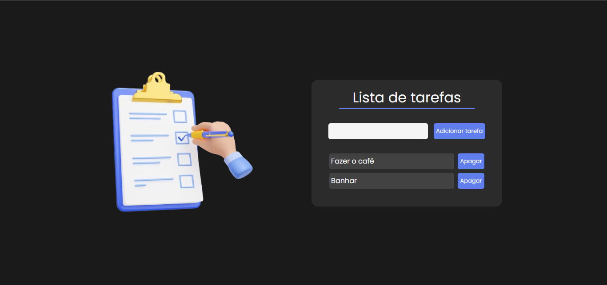
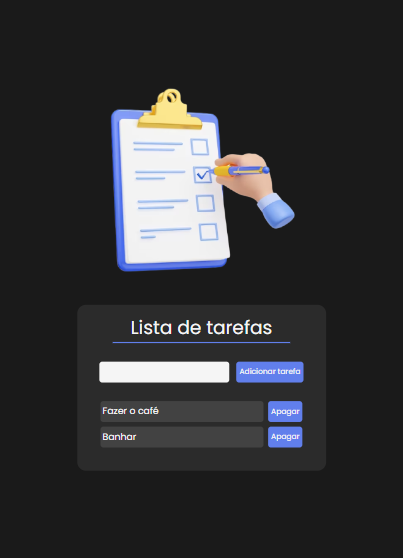

# Lista de tarefas
### Este projeto contém uma aplicação de lista de tarefas (ToDoList) desenvolvida em HTML, CSS e JavaScript.

### Funcionalidades:
- Adicionar tarefas à lista.
- Remover tarefas da lista.

### Screenshots

    
    

### Link da aplicação:
#### https://todolist517.netlify.app/
### Instalação:

#### Clone o repositório em sua máquina local.
- git clone https://github.com/AlanManoel/ToDoList.git

#### Navegue até o diretório do projeto.
- cd ToDoList

### Contribuição:
#### Contribuições são bem-vindas! Sinta-se à vontade para abrir uma issue ou enviar um pull request.

### Contato:

  
  
  
  

